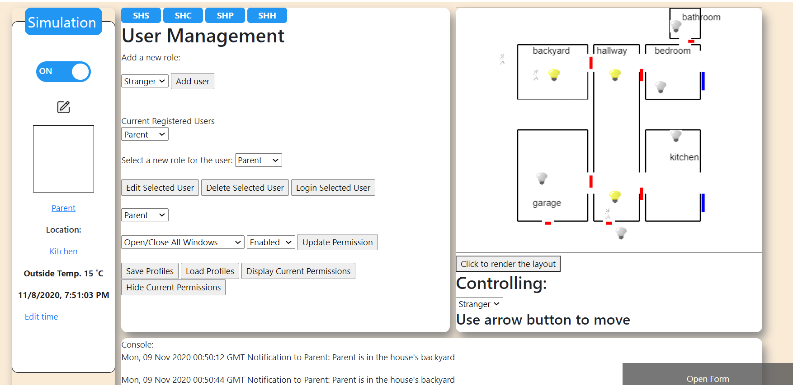
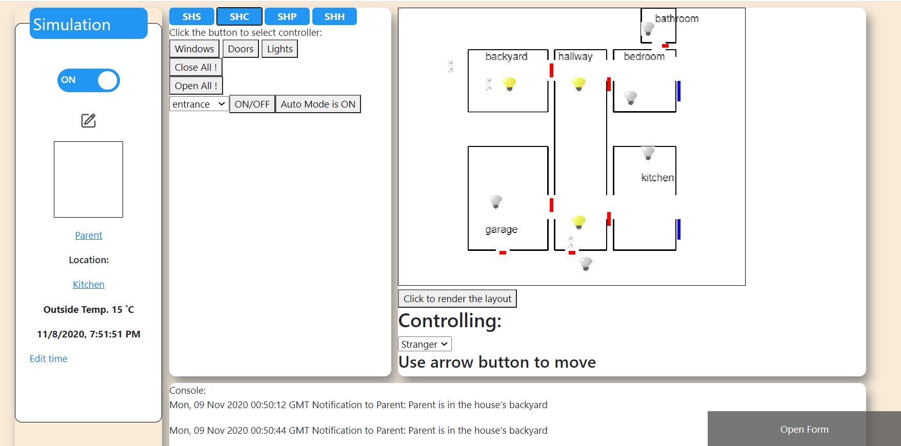
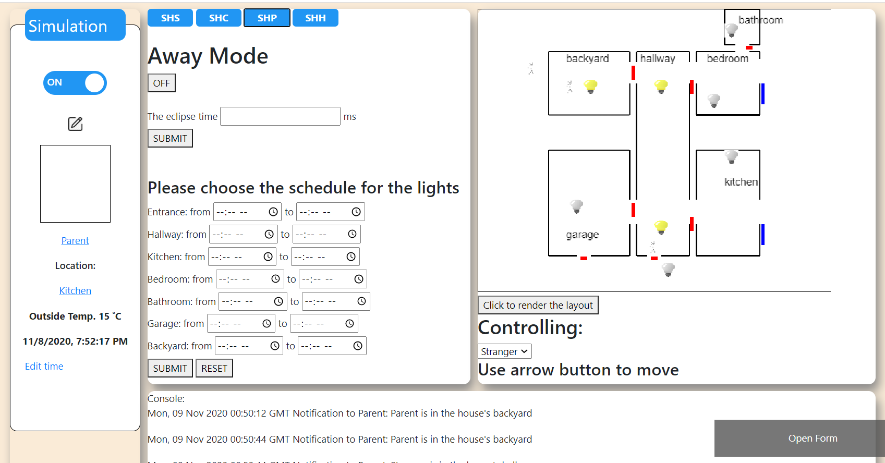

# SOEN343_Delivery-2-
D2_soen343_fall 2020

    Link to D1: https://github.com/kennguyen0303/SOEN343_delivery-1-
<h1> Prepared by: </h1>

1.The Kien Nguyen – Kennguyen0303

2. Shijun Deng - Alex-DSJ

3. Abdalla Osman - abda9725 

4. Daniela Venuta - daniela-venuta

5. Nathan Ziri - Nathan Ziri

--------------------------------------
Demo video: https://www.youtube.com/watch?v=e0vMprGrJEE&feature=youtu.be&ab_channel=KenNguyen

<h2> Updates from Deliverable 1 </h2>

<ol>
  
  <li>SHC: Controls for lights, doors and windows separately. For lights, there is Auto mode which turning lights on/off based on the room's vacancy.</li>
  <li> To be updated... Need time for assignments first</li>
  </ol>

<h2>A few snapshots from the User Interface! </h2>

<h4>SHS tab</h4>

<h4>SHC tab</h4>

<h4>SHP tab</h4>

